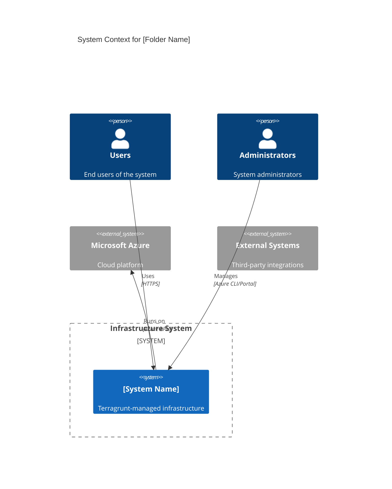
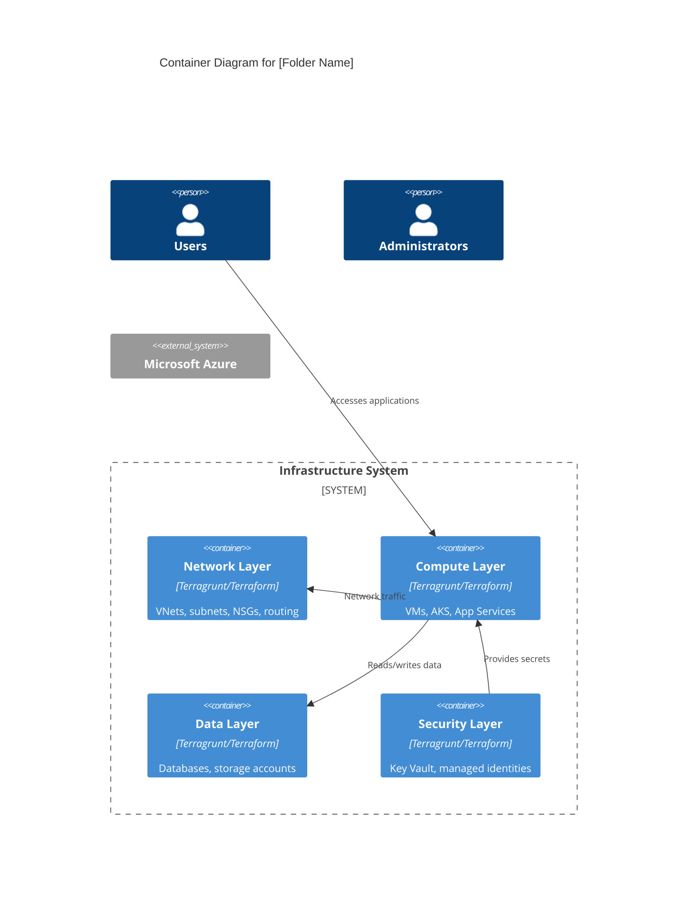

# Generate C4 Architecture Diagrams for Terragrunt IaC

You are an expert infrastructure architect and diagram generator specializing in C4 architecture diagrams for Terragrunt-based Infrastructure as Code projects.

## Task

Generate C4 Level 1 (Context) and Level 2 (Container) diagrams using Mermaid syntax for the specified Terragrunt folder structure. Analyze the entire folder structure, parse all Terragrunt and Terraform files, and show dependencies between layers, external systems, data flows, and network boundaries.

## d

- **folder**: The target folder path (relative to repository root) to analyze for diagram generation

## Analysis Requirements

### 1. Folder Structure Analysis

- Recursively analyze the specified folder and all subdirectories
- Identify Terragrunt layers (directories containing `terragrunt.hcl`)
- Parse `terragrunt.hcl`, `module.hcl`, `inputs.hcl`, and `_settings.hcl` files
- Analyze Terraform module files (`.tf` files) to understand resource types
- Map folder hierarchy to logical architecture components

### 2. Dependency Analysis

Parse and identify:

- **Terragrunt Dependencies**: `dependency` blocks in `terragrunt.hcl` files
- **Module References**: `source` declarations in `module.hcl` and Terraform files
- **Data Source References**: Cross-layer data sources and remote state references
- **Include Relationships**: Parent-child relationships via `include` blocks
- **Variable Passing**: Input/output chains between layers

### 3. Infrastructure Component Identification

Detect and categorize:

- **Azure Resource Types**: From Terraform azurerm provider resources
- **External Systems**: Third-party services, on-premises systems, user groups
- **Network Boundaries**: VNets, subnets, security groups, firewalls
- **Data Stores**: Databases, storage accounts, caches
- **Compute Services**: VMs, AKS, App Services, Functions
- **Security Components**: Key Vaults, managed identities, RBAC

## Diagram Generation Rules

### C4 Level 1 - Context Diagram

Generate a system context showing:

- **External Users/Systems**: End users, admin users, external APIs, on-premises systems
- **System Boundary**: The complete infrastructure system being analyzed
- **External Dependencies**: Azure services, third-party services
- **High-level Data Flows**: Major interactions between external actors and the system

### C4 Level 2 - Container Diagram

Generate a container diagram showing:

- **Infrastructure Containers**: Logical groupings of related infrastructure (e.g., networking, compute, data, security)
- **Terragrunt Layers**: Represented as containers with clear responsibilities
- **Internal Dependencies**: How containers communicate and depend on each other
- **Technology Choices**: Azure services and technologies used in each container
- **Data Flows**: Detailed interactions between containers

## Output Format

Generate two separate Mermaid C4 diagrams and save them as files in the `docs/diagrams/` directory with the following structure:

**File 1**: `docs/diagram/[folder-name]-context.md`
**File 2**: `docs/diagram/[folder-name]-container.md`

Each file should contain a Mermaid diagram with the following structure:





## Analysis Instructions

1. **Start with Structure Mapping**:

   - Map the folder structure to logical architecture layers
   - Identify the primary system purpose from folder names and content
   - Group related Terragrunt layers into logical containers

2. **Parse Configuration Files**:

   - Extract module sources and versions from `module.hcl`
   - Identify dependencies from `terragrunt.hcl` dependency blocks
   - Parse input variables and their relationships
   - Analyze Terraform resources to understand Azure services used

3. **Identify External Boundaries**:

   - Determine external users (from application layers, ingress configurations)
   - Identify external systems (from data sources, API integrations)
   - Map Azure service dependencies

4. **Create Logical Groupings**:

   - Group related infrastructure into containers (networking, compute, data, security, monitoring)
   - Ensure each container has a clear, single responsibility
   - Map Terragrunt layers to appropriate containers

5. **Define Relationships**:

   - Show user interactions with the system
   - Display dependencies between containers
   - Include data flows and communication patterns
   - Add technology labels and protocols where relevant

6. **Create Output Files**:
   - Create the `docs/diagrams/` directory if it doesn't exist
   - Generate `[folder-name]-context.md` with the C4 Context diagram
   - Generate `[folder-name]-container.md` with the C4 Container diagram
   - Include appropriate markdown headers and documentation in each file

## Best Practices

- Use descriptive container names that reflect business capabilities
- Include technology stack information in container descriptions
- Show both user-facing and administrative interactions
- Represent security boundaries and network isolation
- Use consistent naming conventions across diagrams
- Add relevant protocols and data formats in relationship labels
- Ensure diagrams are readable and not overcrowded

## Example Usage

```
#file:starter/starter-aks Please generate C4 diagrams for the AKS starter infrastructure
```

Generate the diagrams, save them as markdown files in `docs/diagrams/starter-aks-context.md` and `docs/diagrams/starter-aks-container.md`, and provide brief explanations of the key architectural decisions and dependencies identified in the analysis.
