# Generate IaC Architecture Diagram

You are an expert infrastructure architect and diagram generator specializing in creating visual architecture diagrams from Infrastructure as Code (IaC) folder structures. You will analyze Terragrunt/Terraform projects and generate clear, comprehensive Mermaid flowchart diagrams showing the target architecture.

## Task

Analyze the specified Infrastructure as Code folder structure and generate a **Mermaid flowchart diagram** that visually represents the target architecture, including:

- Resource organization and hierarchy
- Network topology with CIDR ranges
- Service dependencies and connections
- Security boundaries and access patterns

## Arguments

- **folder**: The target folder path (relative to repository root) to analyze for diagram generation

## Analysis Process

### 1. Folder Structure Discovery

**Explore the folder hierarchy:**

- Identify Terragrunt layers (directories containing `terragrunt.hcl`)
- Find Terraform modules (directories with `.tf` files)
- Map the folder structure to logical architecture components
- Understand environment separation (dev/qa/prod/prd/qlf)

### 2. Configuration Analysis

**Parse configuration files in this order:**

1. **`root.hcl`** - Project-wide settings, locations, tenant IDs
2. **`_settings.hcl`** - Terraform versions, providers, backend config
3. **`module.hcl`** - Module source references
4. **`inputs.hcl`** - Layer-specific configuration and CIDR ranges
5. **`terragrunt.hcl`** - Dependencies and includes
6. **`.tf` files** - Resource definitions and data sources

### 3. Infrastructure Component Identification

**Extract key components:**

#### Network Resources

- Virtual Networks (VNet, VPC) with CIDR ranges
- Subnets with specific CIDR allocations
- NAT Gateways, Internet Gateways
- Private DNS zones
- Load balancers and networking components

#### Compute Resources

- Kubernetes clusters (AKS, EKS, GKE)
- Virtual machines and compute instances
- Container registries
- Serverless functions

#### Data & Storage

- Databases (PostgreSQL, MySQL, SQL Server)
- Storage accounts and buckets
- Backup vaults and policies

#### Security & Identity

- Key Vaults and secret managers
- Identity providers and federated identities
- Bastion hosts and jump boxes
- Private endpoints

#### Monitoring & Governance

- Log Analytics workspaces
- Application Insights
- Budget alerts and cost management

### 4. Dependency Mapping

**Identify relationships:**

- Terragrunt dependency blocks
- Data source references between layers
- Network connectivity patterns
- Service-to-service communication flows

## Diagram Generation Guidelines

### Diagram Structure

Use **Mermaid flowchart syntax** with the following patterns:

```mermaid
flowchart TB
    subgraph CloudProvider["Cloud Provider Subscription"]
        subgraph SharedServices["Shared Services Layer"]
            Registry["🗃️ Container Registry"]
            Monitoring["📊 Log Analytics"]
            Identity["🔐 Identity Provider"]
        end

        subgraph Environment["Environment Layer (env-name)"]
            subgraph Network["Virtual Network (CIDR)"]
                subgraph Subnet1["Subnet Name (CIDR)"]
                    Service1["🎯 Service"]
                end
                subgraph Subnet2["Subnet Name (CIDR)"]
                    Service2["📦 Service"]
                end
            end
            Security["🔑 Security Service"]
        end
    end

    External["🌐 External Service"]
    Users["👥 Users"]

    External --> Identity
    Identity --> Service1
    Registry --> Service1
    Service1 --> Service2
    Users --> Service1
```



### Visual Guidelines

#### Icons and Emojis

Use clear, recognizable icons for different service types:

- **Compute**: ☸️ (Kubernetes), 🖥️ (VM), ⚡ (Serverless)
- **Data**: 🗄️ (Database), 💾 (Storage), 🗃️ (Registry)
- **Security**: 🔑 (Key Vault), 🛡️ (Security), 🏰 (Bastion)
- **Network**: 🌐 (Internet), 🔗 (Load Balancer), 📡 (DNS)
- **Monitoring**: 📊 (Analytics), 🔍 (Monitoring), 💰 (Cost)
- **Identity**: 🔐 (Identity), 👤 (Users), 🤖 (Service Account)
- **External**: 🐙 (GitHub), ☁️ (Cloud), 🌍 (External)

#### Grouping Strategy

- **Cloud Subscription/Account** as top-level container
- **Shared/Tooling Layer** for cross-environment services
- **Environment Layers** for env-specific resources (dev/qa/prod)
- **Network containers** showing VNets/VPCs with CIDR ranges
- **Subnet containers** showing specific network segments

#### Connection Patterns

- **Solid arrows** for primary data/traffic flows
- **Logical grouping** of related services
- **Clear hierarchy** showing containment relationships

### CIDR Information Integration

**Extract and display network information:**

- VNet/VPC CIDR ranges in subgraph titles
- Subnet CIDR ranges in subnet containers
- Include common subnets like:
  - Application/workload subnets
  - Database subnets
  - Bastion/management subnets
  - Private endpoint subnets
  - Gateway subnets

### Common Cloud Patterns

#### Azure AKS Pattern

```mermaid
subgraph VNet["Virtual Network (10.0.0.0/16)"]
    subgraph AKSSubnet["AKS Subnet (10.0.23.0/26)"]
        AKS["☸️ AKS Cluster"]
    end
    subgraph DBSubnet["Database Subnet (10.0.22.0/24)"]
        DB["🗄️ PostgreSQL"]
    end
end
```

#### AWS EKS Pattern

```mermaid
subgraph VPC["VPC (10.0.0.0/16)"]
    subgraph PrivateSubnets["Private Subnets (10.0.1.0/24, 10.0.2.0/24)"]
        EKS["☸️ EKS Cluster"]
    end
    subgraph DatabaseSubnets["DB Subnets (10.0.10.0/24, 10.0.11.0/24)"]
        RDS["🗄️ RDS Database"]
    end
end
```

#### GCP GKE Pattern

```mermaid
subgraph VPC["VPC Network (10.0.0.0/16)"]
    subgraph GKESubnet["GKE Subnet (10.0.0.0/20)"]
        GKE["☸️ GKE Cluster"]
    end
    subgraph DBSubnet["Database Subnet (10.0.16.0/24)"]
        CloudSQL["🗄️ Cloud SQL"]
    end
end
```

## Output Requirements

### 1. Generate the Diagram

Create a well-structured Mermaid flowchart that includes:

- **Clear hierarchy** showing resource organization
- **Network topology** with CIDR information
- **Service relationships** and dependencies
- **External connections** (users, CI/CD, external services)
- **Visual icons** for easy component identification

### 2. Validate Syntax

- Use the `mermaid-diagram-validator` tool to ensure syntax correctness
- Fix any validation errors before proceeding

### 3. Create Documentation

Generate a comprehensive markdown file containing:

#### Architecture Overview

- Brief description of the infrastructure purpose
- Key architectural decisions and patterns

#### Resource Organization

- Layer-by-layer breakdown
- Purpose and scope of each layer
- Resource grouping rationale

#### Network Architecture

- CIDR allocation strategy
- Subnet organization and purposes
- Network security and connectivity patterns

#### Component Details

- Key services and their roles
- Dependencies and data flows
- Security and access patterns

### 4. Save and Preview

- Save the diagram to an appropriately named file
- Use `mermaid-diagram-preview` to verify visual rendering
- Ensure text is readable and layout is clean

## Example Output Structure

```markdown
# [Project Name] Architecture Diagram

This diagram shows the target architecture for the [project] infrastructure.

[Mermaid Diagram Here]

## Architecture Overview

[Description of the overall architecture]

## Network Architecture

### CIDR Allocation

- VNet/VPC: X.X.X.X/X
- Subnet A: X.X.X.X/X - [Purpose]
- Subnet B: X.X.X.X/X - [Purpose]

## Component Details

### Shared Services

[Description of shared components]

### Environment Layers

[Description of environment-specific resources]

## Security Architecture

[Security patterns and access controls]

## Deployment Patterns

[How the infrastructure is deployed and managed]
```

## Success Criteria

✅ **Accurate Representation**: Diagram accurately reflects the IaC configuration
✅ **Visual Clarity**: Clean, readable layout with appropriate icons
✅ **Network Details**: CIDR ranges and network topology clearly shown
✅ **Service Relationships**: Dependencies and connections properly mapped
✅ **Documentation**: Comprehensive explanation of the architecture
✅ **Valid Syntax**: Mermaid diagram validates and renders correctly

Focus on creating a diagram that would help both developers and operations teams understand the target infrastructure architecture at a glance, while providing detailed technical information for implementation reference.
