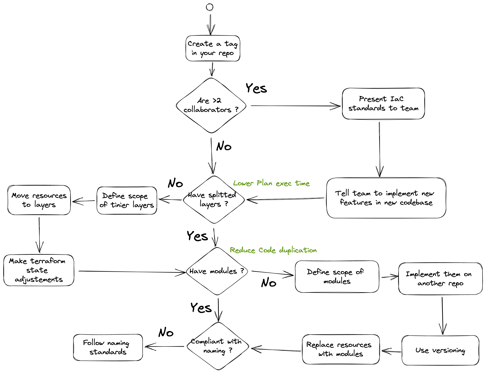

# Refactoring

## Why do you need refactoring ?

Refactoring your codebase terraform is a necessity within the lifecycle of your codebase.
As your infrastructure grows and as you add collaborators to the project, you'll need to reconsider things like :

- the size of the layers
- the scope of the modules
- the interface of the modules

To keep track of your continuous changes, you should set up "quality probes", which will serve as goals the refactored codebase aims to reach like :

- the maximum time a plan can take
- the number of variables you need to provide before implementing the layer
- the time it takes to implement your 3 most frequent tasks.

## Questions to ask yourself

Your priorities regarding a refactoring are the following in this order :

1. Control code quality
2. Accelerate feature promotion
3. Reduce code duplication
4. Improve readability

### How many collaborators are contributing to the codebase ? #CodeQualityControl

- Less than 2 *aka you and a partner*.

  You should frequently work in pair and communicate on the refacto. You must review each others PR, that way both of you will have the entire knowledge of what's merged into the codebase.

- 3 collaborators and more *aka a team*.

  What's risky with a team refactoring a codebase is poor quality code merged into the codebase due to a loss in information transmission. To control code quality over time during the refactoring you need to proceed as follows :

  - Write out the new standards you want to implement
  - Dedicate time on formation for members of the team on the new standards
  - Archive your current codebase
  - Then start implementing on a dedicated codebase

  That way you'll have a clear view on your refactored code.

### Do you have splitted layers ? #Accelerate

The anti-pattern of this is having **only one terraform state** with every resources in it. This slows down the pace of feature promotion.

To know how to define the scope of the new layers, you can ask yourself how to dispatch resources **in 3 states** or also in 3 folders. You can rely on the 3-tier way of splitting an architecture. If you realize while refactoring that terraform plans takes too long (more than 1 minute), you may need to split it again.

The gains would be :

- Reduce time spent on terraform plan and apply
- To decouple resources with different update frequency (for instance : **DNS records** may be updated frequently to add new endpoints whereas **VPC** are created once and never updated)
- Anticipate the scope definition of your yet to be written modules

### Do you have modules ? #DRY

Modules serve 1 purpose : Don't repeat yourself. You write modules for 2 reasons :

- Wrap multiple resources under 1 logic bloc
- Hide complexity from layers.

Use as much modules from the Padok's library or Providers repositories as you can. If no module there matches you needs, here is how you should implement modules in your codebase :

- Identify similar resources created between your environments
- Spot the differences in configuration between them
- Put resources in the module leaving only the necessary configuration in the interface

### Are your resources compliant with naming standards ? #CleanCode

Once you have your modules, you should focus on code readability and maintainability. First off, implement naming standards

### Is your codebase growing ? Is your project in build phase ?

  - Yes
    - Goal : stop technical debt for new implementations
      - **Freeze old codebase & start a new codebase** : the new changes will make your refactoring much harder. If you do not, you or other collaborators will be tempted to implement features using this codebase and so it'll increase the number of resources to refactor.
    - Force team to implement using the [new standards](./) on the new codebase
    - If old resources are needed (like VPCs), use datasources in the new codebase
    - Dedicate time within your sprint to implement the refactoring (don't try to do it in addition of your delivery)
      - If possible 50/50, depending on delivery pressure.

  - No
    - Plan the refactoring as an epic (or a macro) of your roadmap/PVLS
    - You can **refactor the codebase from within** (see bellow)

- How many layers ? Do you implement the 'blueprint' pattern ?

- Do you need to change resources naming ?

## Don'ts

- Trying to change mutliple parts or make multiple steps at once.
  
  It's very tempting to change a parameter on the resource or bump some versions while migrating to modules. But taking small steps and splitting complexity is always a better idea. Proceed at slow pace but keep the plan clear.

- Split in too many layers

  This creates incomprehensible codebase, the information is spread across so many files that you won't have a reliable comprehension of what your infrastructure stack is made of.

## Solutions

### From scratch

#### Why

- Allows to take a step back and design the scopes of layers and modules
- Minimize the state locks so more co-working

#### How

- Create a new git repo
- Create new states (they can be on the same bucket)
- List every resources on the old codebase and diff/compare/count with the new one
- Keep track of what is maintained on wich codebase

Drawbacks
    - imports within modules is currently not supported by terraform

## From within (editing current repo)

- you could pull the state locally and iterate with `—no-refresh`
