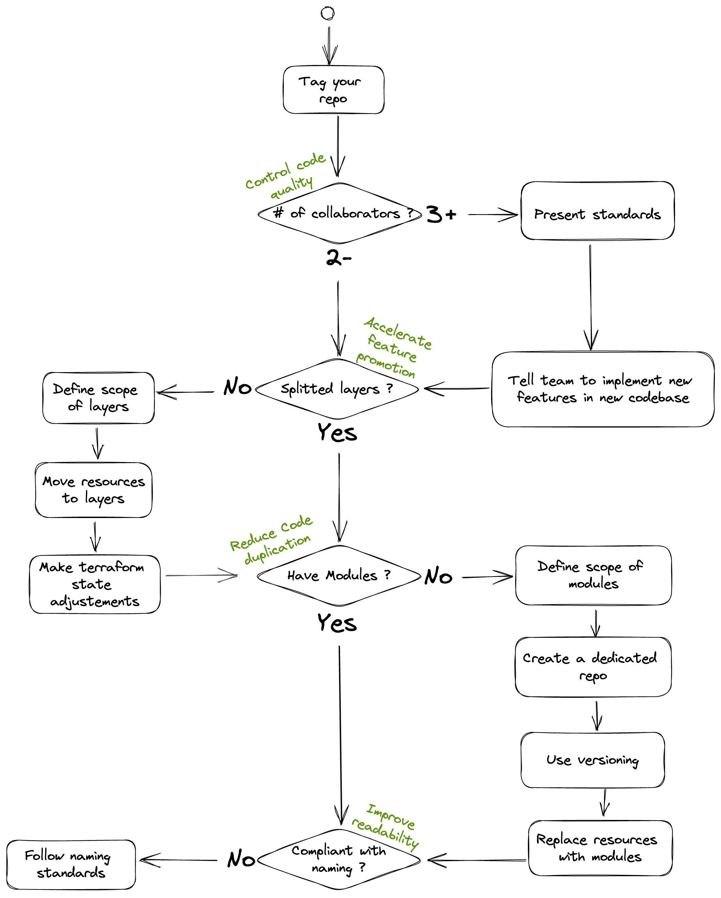

# Refactoring

## Why do you need refactoring ?

Refactoring your codebase terraform is a necessity within the lifecycle of your codebase.
As your infrastructure grows and as you add collaborators to the project, you'll need to reconsider things like :

- the size of the layers
- the scope of the modules
- the interface of the modules

To keep track of your continuous changes, you should set up "quality probes", which will serve as goals the refactored codebase aims to reach like :

- the maximum time a plan can take
- the number of variables you need to provide before implementing the layer
- the time it takes to implement your 3 most frequent tasks.

## Questions to ask yourself

- How many collaborators are contributing to the codebase ?

  - < 2
    - frequently communicate and work in pair on the refacto.

  - \> 2
    - Write out the new standards you want to implement
    - Dedicate time on formation for members of the team on the new standards
    - Then start implementing

- Is your codebase grawing ? Is your project in build phase ?

  - Yes
    - Goal : stop technical debt for new implementations
      - **Freeze old codebase & start a new codebase** : the new changes will make your refactoring much harder
    - Force team to implement using the new standards on the new codebase
    - If old resources are needed (like VPCs), use datasources in the new codebase
    - Dedicate time within your sprint to implement the refactoring (don't try to do it in addition of your delivery)
      - If possible 50/50, depending on delivery pressure.

  - No
    - Plan the refactoring as an epic (or a macro) of your roadmap/PVLS
    - You can **refactor the codebase from within** (see bellow)

- How many layers ? Do you implement the 'blueprint' pattern ?

- Do you need to change resources naming ?

## Steps

1. Crucial 1st step : Backup / keep a stable history
    - Done with versioning and changelog
        - Primarly on modules if the codebase is splitted, on the mono codebase otherwise
1. Create modules if you don't have
    - Start factorisation / creation of modules with the WYSIWYG pattern

## Don'ts

- Trying to change mutliple parts at once.
  
  It's very tempting to change a parameter on the resource or bump some versions while migrating to modules. But taking small steps and splitting complexity is always a better idea. Proceed at slow pace but keep the plan clear.

## Solutions

### From scratch

#### Why

- Allows to take a step back and design the scopes of layers and modules
- Minimize the state locks so more co-working

#### How

- Create a new git repo
- Create new states (they can be on the same bucket)
- List every resources on the old codebase and diff/compare/count with the new one
- Keep track of what is maintained on wich codebase

Drawbacks
    - imports within modules is currently not supported by terraform

## From within

- you could pull the state locally and iterate with `—no-refresh`
