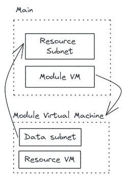

# Refering to resources from other layers

Some infrastructure projects may be split in different layers or repositories.

There are different ways to use resources from other layers in your project.

## TL;DR

> Prefer using [data source](https://www.terraform.io/language/data-sources) when you have to refer to a resource not present in your current code.
> You will increase code consistancy and make sure it fails on plan step and not only on apply


## Using resource data source

In terraform, most resources have a [data source](https://www.terraform.io/language/data-sources) object to refer to an existing object in an other layer. 

**Multiple layers infrastructure**
```bash=
.
├── application
│   ├── main.tf
│   ├── provider.tf
│   └── versions.tf
└── core
    ├── main.tf
    ├── provider.tf
    └── versions.tf
```

**core/main.tf**
```hcl=

# Create a resource group
resource "azurerm_resource_group" "example" {
    name     = "example"
    location = "west-europe"
}
```

**application/main.tf**
```hcl=

# Retrieve a resource group instance 
data "azurerm_resource_group" "example" {
    name     = "example"
    location = "west-europe"
}


resource "azurerm_app_service" "example" {
    name = "example"
    
    resource_group_name = data.azurerm_resource_group.example.name
    location            = data.azurerm_resource_group.example.location

    ...
}
```

By doing that, terraform will check the existence of referred resource at plan step and stop if it does not exist.
Moreover, your code will adapt if the remote resource update its values.

## Using remote state data source

An other way to refer a resource from another layer is to use [remote state data source](https://www.terraform.io/language/state/remote-state-data).

In that way, you will create a correlation between different terraform states. You retrieve the information from a state reflecting the remote infrastructure at its last apply. 

```hcl=
data "terraform_remote_state" "example" {
  backend = "azurerm"
  config = {
    storage_account_name = "example"
    container_name       = "tfstate"
    key                  = "prod.terraform.tfstate"
  }
}

resource "azurerm_virtual_network" "example" {
  name = "example"

  resource_group_name = data.terraform_remote_state.example.outputs.resource_group_name
  location            = data.terraform_remote_state.example.outputs.location
}
```

> This solution is working but it does not create a strong dependancy between layer A and layer B. If you change a parameter in layer A you will have to re-apply both layers. You have to keep tracking your layer dependencies. 

## Using string value (NO!)

The last way yo refer a resource from a different layer is to hard get the string value you want, and pray for it to be valid.

In a small infrastructure it may seem a good idea but it's not since:
1. if you refactor, you will need to change every occurences of hard-coded strings
2. you will fail at apply and not at plan
3. if provider API changes your code will fail

Do not do that.

## Data in terraform modules

Using data in terraform module is not recomanded because it can create circular dependencies between layers and force you to do target apply.




Prefer to set variables in your module, then call your data where your module is applied.