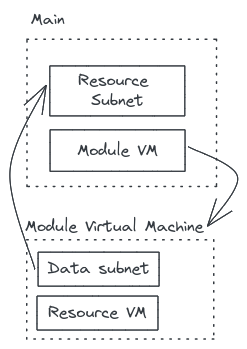

# Refering to resources from other layers

Some infrastructure projects may be split in different layers or repositories.

There are different ways to use resources from other layers in your project.

This standard applies to `terraform` infrastructure. To go further, feel free to read our [terragrunt standard](../terragrunt/refering_to_resources_from_other_layers.md) about layers.

## TL;DR

> Prefer using [data source](https://www.terraform.io/language/data-sources) when you have to refer to a resource not present in your current code.
> You will increase code consistancy and make sure it fails on plan step and not only on apply.

## Using resource data source

In terraform, most resources have a [data source](https://www.terraform.io/language/data-sources) object to refer to an existing object in an other layer.

**Multiple layers infrastructure**

```bash=
.
├── application
│   ├── app.tf
│   └── _settings.tf
└── core
    ├── core.tf
    └── _settings.tf
```

**core/main.tf**

```hcl=

# Create a resource group
resource "azurerm_resource_group" "example" {
    name     = "example"
    location = "west-europe"
}
```

**application/main.tf**

```hcl=

# Retrieve a resource group instance
data "azurerm_resource_group" "example" {
    name     = "example"
    location = "west-europe"
}


resource "azurerm_app_service" "example" {
    name = "example"

    resource_group_name = data.azurerm_resource_group.example.name
    location            = data.azurerm_resource_group.example.location

    ...
}
```

By doing that, terraform will check the existence of referred resource at plan step and stop if it does not exist.
Moreover, your code will adapt if the remote resource update its values.

## Using remote state data source

An other way to refer a resource from another layer is to use [remote state data source](https://www.terraform.io/language/state/remote-state-data).

In that way, you will create a correlation between different terraform states. You retrieve the information from a state reflecting the remote infrastructure at its last apply.

```hcl=
data "terraform_remote_state" "example" {
  backend = "azurerm"
  config = {
    storage_account_name = "example"
    container_name       = "tfstate"
    key                  = "prod.terraform.tfstate"
  }
}

resource "azurerm_virtual_network" "example" {
  name = "example"

  resource_group_name = data.terraform_remote_state.example.outputs.resource_group_name
  location            = data.terraform_remote_state.example.outputs.location
}
```

> This solution is working but it does not create a strong dependancy between layer A and layer B. If you change a parameter in layer A you will have to re-apply both layers. You have to keep tracking your layer dependencies.

## Using string value (NO!)

The last way yo refer a resource from a different layer is to hard get the string value you want, and pray for it to be valid.

In a small infrastructure it may seem a good idea, but it’s not since:

1. if you refactor, you will need to alter every occurrences of hard-coded strings
2. you will fail to apply and not at plan
3. if provider API changes, your code will fail

Do not do that.

## Architecture pattern

When your layer refers to multiple data called for your different modules, you may want to call those data in dedicated files.
In that case, two patterns stand out for your code architecture:

- using a `data.tf` file
- following the [WYSIWYG pattern](./wysiwg_patterns.md)

None of these two pattern is better than the other, but you should choose the one that is more adapted to your need.

### Using a `data.tf` file

A data is like a variable: it is a necessary input to use your module or create your resource. Therefore, all data from a layer should be gather in a single `data.tf` file (as it is for your `variables.tf`).

This way would have the following advantages:

- The code of the implementation of your module/resource is simpler, without a `data` block aside to pollute and affect the readability
- If you need a data that might already be used for another resource, you only have to look in the one `data.tf` file to check if it is already there

Moreover, this does not affect the comprehension of your code, as if your data is well named, you understand easily what it represents and therefore do not need to dive in the `data` block to understand what it is.

```bash=
.
├── core.tf
├── data.tf
└── _settings.tf
```

### Following the WYSIWYG pattern

As an antipattern of the solution above, following our wysiwyg convention involves creating files refering the purpose of your data.

In that way, you will know where to search your existing data simply by its purpose and not by its code origin. The data is considered as a part of your infrastructure code and not as an input.

```bash=
.
├── core.tf
├── rg.tf
├── virtual_network.tf
└── _settings.tf
```

## Data in terraform modules

Using data in terraform module is not recomanded because it can create circular dependencies between layers and force you to do target apply.



Prefer to set variables in your module, then call your data where your module is applied.
